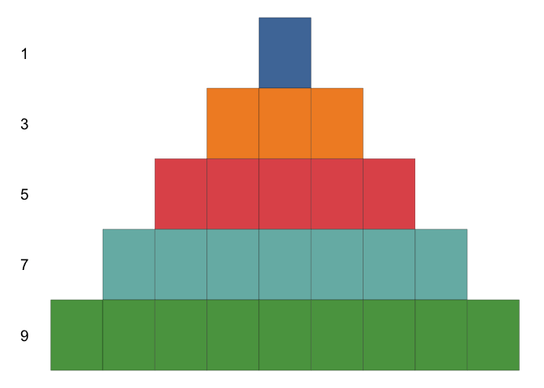
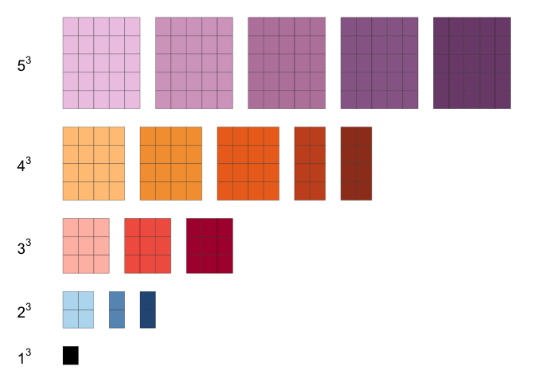
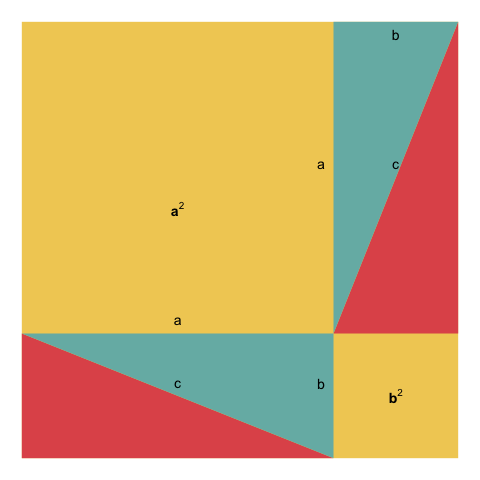

## Example 1:

$$ \sum_{i = 1}^n(2i - 1) = n^2 $$
The animated version of the proof is show below:

## Example 2:

$$ 1^3 + 2^3 + \ldots + (n-1)^3 + n^3 = (1 + 2 + \ldots + n)^2 $$
The animated version of the proof is shown below:

## Example 3

$$ \frac{1}{2^2} + \frac{1}{2^4} + \frac{1}{2^6} + \frac{1}{2^8} + \ldots = \frac{1}{3} $$

## Example 4

